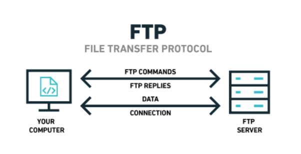

# Installation de services réseau

Dans cette SAE, nous devions créer un service réseaux et le faire marcher sur un conteneur docker.

## Introduction

Pour notre projet, nous avons choisi de créer un **serveur de partage de fichiers** après avoir débattu pendant longtemps.
Ce projet peut paraître simple, mais il demande beaucoup de configuration pour marcher, spécialement sur docker.

Nous avions d'abord tenté de faire un serveur **GitLab**, mais après de longs heurs, nous avons abandonnée.

Nous avons choisi le service **ProFTPd** car nous avons trouvé beaucoup de ressources pour sa configuration.

## Docker

Docker est une plateforme permettant de lancer certaines applications dans des conteneurs logiciels.
Docker nous permet de créer une seule application qui marchera sur toutes les machines.

## Partage de fichier

Il y a plusieurs systèmes de partage de fichiers, tous avec leur utilisation particulière :
- FTP : **File Transfer Protocol, ou FTP**, est un protocole de communication destiné au partage de fichiers sur un réseau TCP/IP.
- SMB : **Server Message Block, ou SMB**, est un protocole permettant le partage de ressources sur des réseaux locaux avec des PC sous Windows.
- NFS : **Network File System, ou NFS**, littéralement système de fichiers en réseau, est à l'origine un protocole développé par Sun Microsystems en 1984 qui permet à un ordinateur d'accéder via un réseau à des fichiers distants.

## FTP

Nous avons choisi FTP car c'est le system le plus simple à implémenter et à utiliser.
Il marche par créer une connexion entre le client et le serveur pour transférer les commandes, et crée d'autres connectaient pour transférer les données.

## Creation du Dockerfile

Nous avons pris comme base un Dockerfile d'un TP, et modifié pour marcher avec notre nouvelle configuration.
Nous avons aussi recherché la syntaxe correcte pour notre utilisation sur Google.
Ce Dockerfile installe les paquets nécessaires, met en place le fichier de configuration, crée les utilisateurs et expose les ports.

Il a fallu exposer le port 21 (FTP) mais aussi les ports utiles au transfert de données passives.

## Configuration de ProFTPd

Afin de configurer ProFTPd, nous avons utilisé pour base une configuration trouvée sur Google, puis nous l'avons beaucoup modifié.
Cette configuration détermine une plage de ports passifs, les permissions des utilisateurs, mais aussi des informations du réseau.

## Problemes

Nous avons eu 2 problèmes :
- **Problème de permission d'utilisateur.**

Au début, les utilisateurs pouvaient créer des fichiers, mais pas les supprimer.
Nous avons d'abord tenté de modifier l'__Umask__, sans effet.
Après beaucoup de recherches, nous avons découvert que la directive __AllowOverwrite__ était désactivée par défaut. Le problème a été réglé une fois activé.
- **Problème du réseau avec les ports passifs.**

Le plus gros problème a été avec les ports passifs, malgré la configuration de Docker et de ProFTPd, nous ne pouvions pas l'atteindre depuis l'extérieur du serveur.

Après des heurts de recherche, nous avons enfin trouvé la directive nécessaire pour les faire marcher, __MasqueradeAddress__.
Le problème étant qu'il essaye d'ouvrir les ports sur la mauvaise adresse, une adresse locale au conteneur.

## Resultat

Après une journée de configuration, nous avons 3 scripts :
- Un pour créer et **lancer le conteneur**.
- Un pour aller en **mode interactive** avec le shell bash.
- Un pour **supprimer** le conteneur.

Pour modifier les utilisateurs, il faut modifier le Dockerfile.

## Conclution

En conclusion, nous avons créé un système de partage de fichiers basé sur la technologie FTP.
Après avoir rencontré plusieurs problèmes, nous avons un conteneur très simple à utiliser et à modifier.
